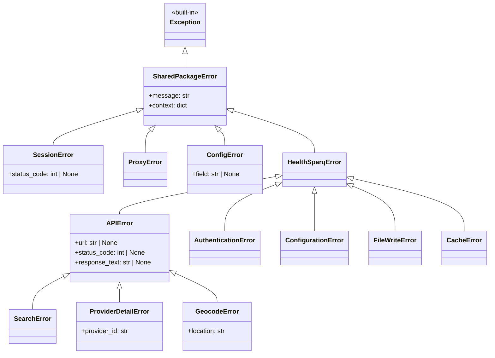

# feat: Consolidate Duplicate Code Between healthsparq and core Packages

## Overview

This plan addresses the significant code duplication between `healthsparq/` (v2.0 scraper library) and `core/` (shared utilities v3.0). The consolidation eliminates ~300+ lines of duplicate code while preserving backward compatibility and improving maintainability.

**Impact**: 23 HealthSparq projects + library users with custom mappers

**Risk Level**: Medium (requires phased rollout with deprecation period)

---

## Problem Statement

### Current State

The `healthsparq` package duplicates functionality from the `core` package:

| Component               | healthsparq Location        | core Location                        | Duplication                       |
| ----------------------- | --------------------------- | ------------------------------------ | --------------------------------- |
| `normalize_zip_code()`  | phases/normalize.py:75-91   | mapper/normalize.py:6-16             | **IDENTICAL**                     |
| `clean_network_name()`  | phases/normalize.py:66-72   | mapper/normalize.py:49-60            | **SIMILAR** (different signature) |
| `deduplicate_by_npi()`  | phases/normalize.py:318-334 | mapper/dedup.py:55-77                | **IDENTICAL**                     |
| `merge_provider_data()` | phases/normalize.py:274-315 | mapper/dedup.py:7-52                 | **IDENTICAL**                     |
| `MapperFunc` type alias | phases/normalize.py:33      | mapper/base.py:9                     | **IDENTICAL**                     |
| Retry logic             | core/session.py:132-170     | session/resilient_session.py:261-314 | **DIFFERENT** implementations     |
| Exception hierarchy     | core/exceptions.py          | exceptions.py                        | **PARALLEL** hierarchies          |

### Problems

1. **Maintenance burden**: Bug fixes must be applied in multiple places
2. **Drift risk**: Implementations may diverge over time
3. **Confusion**: Unclear which version is canonical
4. **Missing features**: healthsparq retry lacks proxy rotation, rate limit handling

---

## Proposed Solution

### Architecture Decision

**Single Source of Truth**: All shared utilities live in `core/`, healthsparq imports from there.

```
core/                           healthsparq/
├── mapper/                     ├── phases/
│   ├── normalize.py  ◄────────────── normalize.py (imports from core)
│   ├── dedup.py      ◄────────────── (imports from core)
│   └── base.py       ◄────────────── (imports MapperFunc)
├── exceptions.py     ◄────────── core/exceptions.py (inherits from core)
└── session/          ◄────────── core/session.py (delegates to core)
```

### Design Principles

1. **Backward Compatibility**: No breaking changes to public APIs in Phase 1
2. **Deprecation Warnings**: Warn users migrating from old import paths
3. **Phased Rollout**: Internal changes first, then deprecation, then removal
4. **Testing Parity**: Output must be byte-identical before/after consolidation

---

## Technical Approach

### Phase 1: Normalization Utilities Consolidation

#### 1.1 Import normalize_zip_code from core

**File**: `healthsparq/phases/normalize.py`

**Current** (lines 75-91):

```python
def normalize_zip_code(zip_code: str | None) -> str | None:
    """Normalize ZIP code to 5 digits as per schema requirements."""
    if zip_code is None:
        return None
    cleaned = zip_code.replace("-", "").replace(" ", "").strip()
    if len(cleaned) >= 5 and cleaned[:5].isdigit():
        return cleaned[:5]
    return None
```

**After**:

```python
# Import from core (single source of truth)
from core.mapper.normalize import normalize_zip_code

# Delete local implementation (lines 75-91)
```

#### 1.2 Import clean_network_name with wrapper

**Challenge**: healthsparq has hardcoded `"medica_sg" → "medica"` replacement

**Solution**: Use core's parameterized version with project-specific config

**File**: `healthsparq/phases/normalize.py`

**Current** (lines 66-72):

```python
def clean_network_name(name: str) -> str:
    """Clean network name by removing quotes, backslashes, and normalizing."""
    return (
        name.replace('"', "")
        .replace("\\", "")
        .replace("medica_sg", "medica")
    )
```

**After**:

```python
from core.mapper.normalize import clean_network_name as _core_clean_network_name

# Project-specific replacements
_NETWORK_REPLACEMENTS = {"medica_sg": "medica"}

def clean_network_name(name: str) -> str:
    """Clean network name with project-specific replacements."""
    return _core_clean_network_name(name, replacements=_NETWORK_REPLACEMENTS)
```

#### 1.3 Import deduplication functions from core

**File**: `healthsparq/phases/normalize.py`

**Current** (lines 274-334):

```python
def merge_provider_data(existing: dict, new: dict) -> dict:
    # ~40 lines of merge logic

def deduplicate_by_npi(records: list) -> tuple[list, int]:
    # ~15 lines of dedup logic
```

**After**:

```python
from core.mapper.dedup import (
    merge_provider_records as merge_provider_data,  # Alias for backward compat
    deduplicate_by_npi,
)

# Delete local implementations (lines 274-334)
```

#### 1.4 Import MapperFunc type alias

**File**: `healthsparq/phases/normalize.py`

**Current** (line 33):

```python
MapperFunc = Callable[[dict[str, Any]], dict[str, Any]]
```

**After**:

```python
from core.mapper.base import MapperFunc

# Delete local definition (line 33)
```

### Phase 2: Exception Hierarchy Consolidation

#### 2.1 Make healthsparq exceptions inherit from core

**File**: `healthsparq/core/exceptions.py`

**Current**:

```python
class HealthSparqError(Exception):
    """Base exception for all HealthSparq errors."""
    pass

class APIError(HealthSparqError):
    """API request failed."""
    pass
```

**After**:

```python
from core.exceptions import SharedPackageError, SessionError as CoreSessionError

class HealthSparqError(SharedPackageError):
    """Base exception for all HealthSparq errors.

    Inherits from core.exceptions.SharedPackageError for unified error handling.
    """
    pass

class APIError(HealthSparqError):
    """API request failed.

    Attributes:
        url: The URL that failed
        status_code: HTTP status code
        response_text: Truncated response body
    """
    def __init__(
        self,
        message: str,
        *,
        url: str | None = None,
        status_code: int | None = None,
        response_text: str | None = None,
    ) -> None:
        context = {
            "url": url,
            "status_code": status_code,
            "response_text": response_text[:500] if response_text else None,
        }
        super().__init__(message, context=context)
        self.url = url
        self.status_code = status_code
        self.response_text = response_text
```

**Keep Domain-Specific Exceptions**: `SearchError`, `ProviderDetailError`, `GeocodeError` remain in healthsparq (they have domain-specific attributes).

### Phase 3: Retry Logic Consolidation

#### 3.1 Create shared retry utility in core

**New File**: `core/retry.py`

```python
"""Retry utilities with configurable backoff strategies."""

from __future__ import annotations

import asyncio
import functools
from dataclasses import dataclass, field
from typing import Any, Callable, TypeVar

try:
    from core.logging import logger
except ImportError:
    import logging
    logger = logging.getLogger(__name__)

F = TypeVar("F", bound=Callable[..., Any])


@dataclass
class RetryConfig:
    """Configuration for retry behavior."""

    max_retries: int = 5
    backoff_factor: float = 2.0
    max_backoff: float = 30.0
    retry_status_codes: set[int] = field(
        default_factory=lambda: {500, 502, 503, 504}
    )
    recreate_status_codes: set[int] = field(
        default_factory=lambda: {401, 403, 429}
    )
    rate_limit_delay: float = 60.0


async def retry_with_backoff(
    operation: Callable[[], Any],
    config: RetryConfig,
    on_retry: Callable[[int, Exception | None, int | None], None] | None = None,
) -> Any:
    """Execute async operation with exponential backoff retry.

    Args:
        operation: Async callable to execute
        config: Retry configuration
        on_retry: Optional callback(attempt, exception, status_code)

    Returns:
        Operation result

    Raises:
        Last exception if all retries exhausted
    """
    last_exception: Exception | None = None

    for attempt in range(config.max_retries):
        try:
            result = await operation()

            # Check for status codes that need retry
            status_code = getattr(result, "status_code", None)

            if status_code == 429:
                # Rate limited - special delay
                logger.warning(f"Rate limited, waiting {config.rate_limit_delay}s")
                await asyncio.sleep(config.rate_limit_delay)
                continue

            if status_code in config.recreate_status_codes:
                # Auth/session error - will be handled by caller
                if on_retry:
                    on_retry(attempt, None, status_code)
                continue

            if status_code in config.retry_status_codes:
                # Server error - retry with backoff
                sleep_time = min(
                    config.backoff_factor ** attempt,
                    config.max_backoff,
                )
                logger.warning(f"Server error {status_code}, retrying in {sleep_time:.1f}s")
                await asyncio.sleep(sleep_time)
                continue

            if status_code is None or status_code < 400:
                return result

        except Exception as e:
            last_exception = e
            if on_retry:
                on_retry(attempt, e, None)

        # Exponential backoff
        if attempt < config.max_retries - 1:
            sleep_time = min(
                config.backoff_factor ** attempt,
                config.max_backoff,
            )
            logger.debug(f"Retrying in {sleep_time:.1f}s (attempt {attempt + 1}/{config.max_retries})")
            await asyncio.sleep(sleep_time)

    if last_exception:
        raise last_exception
    raise RuntimeError("Operation failed with no exception")


# Pre-configured retry configs
SCRAPER_RETRY_CONFIG = RetryConfig(
    max_retries=5,
    backoff_factor=2.0,
    max_backoff=30.0,
)

API_RETRY_CONFIG = RetryConfig(
    max_retries=3,
    backoff_factor=1.5,
    max_backoff=10.0,
)
```

#### 3.2 Update healthsparq session to use core retry

**File**: `healthsparq/core/session.py`

**Current** (lines 132-170):

```python
async def _request_with_retry(self, method, url: str, **kwargs):
    """Execute request with exponential backoff retry."""
    # ~40 lines of custom retry logic
```

**After**:

```python
from core.retry import retry_with_backoff, RetryConfig

async def _request_with_retry(self, method, url: str, **kwargs):
    """Execute request with exponential backoff retry."""
    config = RetryConfig(
        max_retries=self.config.max_retries,
        backoff_factor=self.config.backoff_factor,
        max_backoff=self.config.max_backoff,
    )

    async def operation():
        return await method(url, **{k: v for k, v in kwargs.items() if v is not None})

    def on_retry(attempt: int, exc: Exception | None, status_code: int | None):
        if status_code in [401, 403]:
            self._initialized = False
            if self._http_session:
                asyncio.create_task(self._http_session.rotate_proxy())

    return await retry_with_backoff(operation, config, on_retry=on_retry)
```

### Phase 4: Deprecation Layer

#### 4.1 Add deprecation warnings for old imports

**File**: `healthsparq/phases/__init__.py`

```python
"""Phase modules with deprecation support."""

import warnings
from typing import Any

_DEPRECATED_IMPORTS = {
    "normalize_zip_code": "core.mapper.normalize",
    "clean_network_name": "core.mapper.normalize",
    "deduplicate_by_npi": "core.mapper.dedup",
    "merge_provider_data": "core.mapper.dedup.merge_provider_records",
}


def __getattr__(name: str) -> Any:
    if name in _DEPRECATED_IMPORTS:
        new_location = _DEPRECATED_IMPORTS[name]
        warnings.warn(
            f"Importing {name} from healthsparq.phases is deprecated. "
            f"Use {new_location} instead. This will be removed in v3.0.",
            DeprecationWarning,
            stacklevel=2,
        )
        # Import from new location
        if name == "normalize_zip_code":
            from core.mapper.normalize import normalize_zip_code
            return normalize_zip_code
        # ... etc
    raise AttributeError(f"module has no attribute {name!r}")
```

---

## Implementation Phases

### Phase 1: Foundation (No Breaking Changes)

- Duration: 1 sprint
- Risk: Low

**Tasks**:

- [ ] Import `normalize_zip_code` from core in healthsparq
- [ ] Import `clean_network_name` with wrapper for project-specific replacements
- [ ] Import `deduplicate_by_npi` and `merge_provider_records` from core
- [ ] Import `MapperFunc` type alias from core
- [ ] Run full test suite to verify identical output
- [ ] Compare output files byte-by-byte for all 23 projects

**Files Modified**:

- `healthsparq/phases/normalize.py`

**Acceptance Criteria**:

- [ ] All 23 HealthSparq projects produce identical output
- [ ] No import errors in existing code
- [ ] No runtime behavior changes

### Phase 2: Exception Consolidation (Low Risk)

- Duration: 1 sprint
- Risk: Low-Medium

**Tasks**:

- [ ] Make `HealthSparqError` inherit from `core.exceptions.SharedPackageError`
- [ ] Update exception context handling to use `context` dict pattern
- [ ] Keep domain-specific exceptions (SearchError, etc.) in healthsparq
- [ ] Add tests for exception inheritance

**Files Modified**:

- `healthsparq/core/exceptions.py`

**Acceptance Criteria**:

- [ ] `isinstance(HealthSparqError(), SharedPackageError)` returns True
- [ ] Existing `try/except` blocks continue to work
- [ ] Exception messages remain unchanged

### Phase 3: Retry Logic Consolidation (Medium Risk)

- Duration: 2 sprints
- Risk: Medium

**Tasks**:

- [ ] Create `core/retry.py` with shared retry utilities
- [ ] Update `ResilientBrowserSession` to use configurable retry count
- [ ] Update `HealthSparqSession` to use core retry utilities
- [ ] Add 429 rate limit handling with 60s delay
- [ ] Add proxy rotation on auth errors
- [ ] Test retry behavior matches expectations

**Files Modified**:

- `core/retry.py` (new)
- `core/session/resilient_session.py`
- `healthsparq/core/session.py`

**Acceptance Criteria**:

- [ ] Retry behavior is configurable (max_retries, backoff)
- [ ] 429 responses trigger 60s delay
- [ ] Auth errors (401/403) trigger proxy rotation
- [ ] No increase in API errors during scraping runs

### Phase 4: Deprecation and Cleanup

- Duration: 1 sprint (then 2 releases for removal)
- Risk: Low

**Tasks**:

- [ ] Add deprecation warnings for direct imports of moved utilities
- [ ] Update `healthsparq/CLAUDE.md` with migration guide
- [ ] Create `docs/HEALTHSPARQ_CONSOLIDATION_MIGRATION.md`
- [ ] Add automated tests for deprecation warnings
- [ ] Schedule removal for v3.0 (after 2 minor releases)

**Files Modified**:

- `healthsparq/phases/__init__.py`
- `healthsparq/CLAUDE.md`
- `docs/HEALTHSPARQ_CONSOLIDATION_MIGRATION.md` (new)

---

## Acceptance Criteria

### Functional Requirements

- [ ] All 23 HealthSparq projects produce identical output before/after consolidation
- [ ] Custom mapper injection continues to work (`run_scraper_sync(config, date, mapper=my_mapper)`)
- [ ] CLI commands work unchanged (`python -m healthsparq run <project> --curr YYYYMMDD`)
- [ ] Validation flag continues to work (`--validate`)

### Non-Functional Requirements

- [ ] No performance regression (measure normalize phase duration)
- [ ] Memory usage unchanged (deduplication with BoundedSet)
- [ ] Test coverage maintained at 90%+

### Quality Gates

- [ ] All existing tests pass
- [ ] New tests for imported utilities
- [ ] Deprecation warnings emit correctly
- [ ] Code review approved

---

## Success Metrics

| Metric                             | Current | Target                 |
| ---------------------------------- | ------- | ---------------------- |
| Duplicate lines of code            | ~300    | 0                      |
| Import sources for normalize utils | 2       | 1 (core)               |
| Exception base classes             | 2       | 1 (SharedPackageError) |
| Retry implementations              | 2       | 1 (core/retry.py)      |

---

## Dependencies & Prerequisites

### Dependencies

- `core/` package must be accessible from healthsparq (already configured via sys.path)
- No external package dependencies added

### Prerequisites

- [ ] Confirm `core/mapper/normalize.py` has all needed functions
- [ ] Verify `core/mapper/dedup.py` function signatures match
- [ ] Ensure `core/exceptions.py` has `SharedPackageError` with `context` dict

---

## Risk Analysis & Mitigation

| Risk                               | Probability | Impact | Mitigation                                         |
| ---------------------------------- | ----------- | ------ | -------------------------------------------------- |
| Output changes after consolidation | Medium      | High   | Byte-by-byte comparison of all 23 project outputs  |
| Custom mapper breaks               | Low         | Medium | Test pilot project `audiobee_christus_health_plan` |
| Retry behavior changes             | Medium      | Medium | Log retry counts before/after, compare             |
| Import errors in user code         | Low         | Low    | Deprecation warnings, 2-release transition         |
| Performance regression             | Low         | Low    | Benchmark normalize phase duration                 |

---

## Future Considerations

### Post-Consolidation Opportunities

1. **Migrate to `BaseMapper` pattern**: Consider having healthsparq use `core/mapper/healthsparq.HealthSparqMapper` directly
2. **Namespace package**: For 190+ scrapers, consider `ideon.core` namespace
3. **Shared validation**: Move JSON schema validation toggle to core
4. **Unified logging**: Standardize log message formats across packages

### Out of Scope

- Renaming `healthsparq/core/` to avoid confusion with root `core/`
- Migrating YAML configs to use `network_replacements` parameter
- Converting `load_raw_details()` from list to iterator

---

## References & Research

### Internal References

- `healthsparq/phases/normalize.py` - Current duplication location
- `core/mapper/normalize.py` - Canonical normalization utilities
- `core/mapper/dedup.py` - Canonical deduplication logic
- `core/session/resilient_session.py` - Retry with session recreation
- `healthsparq/core/session.py` - Current retry implementation
- `docs/migration/OUTPUT_GENERATOR_TO_CORE_QA.md` - Migration pattern template

### External References

- [Python Monorepo Best Practices - Tweag](https://www.tweag.io/blog/2023-04-04-python-monorepo-1/)
- [Tenacity Documentation](https://tenacity.readthedocs.io/)
- [PEP 387 - Backwards Compatibility Policy](https://peps.python.org/pep-0387/)

### Related Work

- Previous migration: output_generator → core/qa (Dec 2025)
- HealthSparq v2.0 library transformation (completed)
- DataStore abstraction layer (completed)

---

## Appendix: Code Diff Summary

### Lines to Remove from healthsparq/phases/normalize.py

| Lines   | Function                | Replacement                                               |
| ------- | ----------------------- | --------------------------------------------------------- |
| 33      | `MapperFunc` type alias | `from core.mapper.base import MapperFunc`                 |
| 66-72   | `clean_network_name()`  | Wrapper around `core.mapper.normalize.clean_network_name` |
| 75-91   | `normalize_zip_code()`  | `from core.mapper.normalize import normalize_zip_code`    |
| 274-315 | `merge_provider_data()` | `from core.mapper.dedup import merge_provider_records`    |
| 318-334 | `deduplicate_by_npi()`  | `from core.mapper.dedup import deduplicate_by_npi`        |

**Total**: ~80 lines removed, ~10 lines added (imports + wrapper)

### Lines to Remove from healthsparq/core/session.py

| Lines   | Function                | Replacement                         |
| ------- | ----------------------- | ----------------------------------- |
| 132-170 | `_request_with_retry()` | Use `core.retry.retry_with_backoff` |

**Total**: ~40 lines replaced with ~15 lines using core utility

---

## ERD: Exception Hierarchy After Consolidation



---

_Plan created: 2025-12-28_
_Author: Claude Code Analysis_
