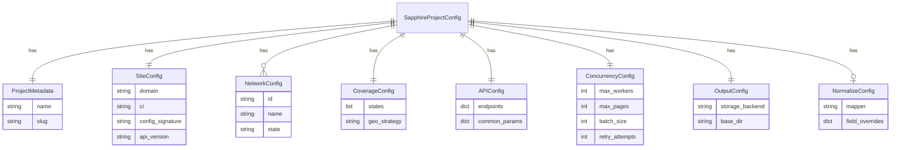

# feat: Sapphire Package - Scalable Scraping Library

## Overview

Create a `sapphire/` package that consolidates 15 Sapphire (ProviderFinderOnline) site implementations into a shared library, following the proven healthsparq architecture pattern while introducing improvements for better maintainability, performance, and developer experience.

## Problem Statement / Motivation

### Current State

- **15 Sapphire projects** exist with **40-50% code duplication**
- Each project independently implements:
  - `playwright_queue_session.py` (95% identical across projects)
  - `config.py` (90% shared structure)
  - `index_0.py` / `index_1.py` / `3_map_json_to_ideon_format.py` (70-85% similar)
  - `utils.py` helper functions (85% identical)
- **No shared library** exists - each project is isolated
- **Maintenance burden**: Bug fixes require updating 15+ files
- **Configuration drift**: Different versions, hardcoded credentials
- **~500KB+ wasted** on duplicated code

### Affected Projects

| Project                   | States     | Network Type   | Complexity       |
| ------------------------- | ---------- | -------------- | ---------------- |
| audiobee_molina           | 19 states  | Multi-network  | High (reference) |
| audiobee_bcbs_il          | IL         | Single network | Medium           |
| audiobee_bcbs_kc          | MO, KS     | Dual state     | Medium           |
| audiobee_bcbs_la          | LA         | Single network | Low              |
| audiobee_bcbs_mn          | MN         | Dual network   | Medium           |
| audiobee_bcbs_mt          | MT         | Single network | Low              |
| audiobee_bcbs_ne          | NE         | Single network | Low              |
| audiobee_bcbs_nm          | NM         | Single network | Low              |
| audiobee_bcbs_sc_medicaid | SC         | Medicaid       | Low              |
| audiobee_bcbs_tx          | TX         | Single network | Low              |
| audiobee_bcbs_vt          | VT         | Single network | Low              |
| audiobee_carefirst        | MD, VA, DC | Tri-state      | Medium           |
| audiobee_cox_health_plans | MO         | Medicare       | Low              |
| audiobee_instil_health    | SC         | Medicare       | Low              |
| audiobee_st_lukes         | ID         | ACA            | Low              |

### Why Now

- HealthSparq library (23 projects) proves the consolidation pattern works
- Core package v3.0 provides mature abstractions (DataStore, MapperFunc, QA)
- Existing unified framework plan (`plans/feat-unified-scraping-framework.md`) targets Sapphire

---

## Proposed Solution

Create `sapphire/` package mirroring healthsparq architecture:

```
sapphire/
├── __init__.py                 # Public API exports
├── __main__.py                 # CLI entry point
├── cli.py                      # Typer CLI commands
├── api.py                      # High-level API (run_scraper_sync, ScraperResult)
├── config/
│   ├── __init__.py
│   ├── schema.py               # Pydantic config models
│   └── loader.py               # YAML config loading with inheritance
├── core/
│   ├── __init__.py
│   ├── sapphire_api.py         # Sapphire API wrapper (replaces HealthSpark)
│   ├── session.py              # Browser queue session management
│   ├── storage.py              # Core.io adapter layer
│   └── exceptions.py           # Sapphire-specific exceptions
├── phases/
│   ├── __init__.py             # Phase exports
│   ├── discovery.py            # Phase 1: Geographic provider ID discovery
│   ├── details.py              # Phase 2: Provider detail extraction
│   ├── normalize.py            # Phase 3: Normalization with mapper injection
│   ├── qa.py                   # Phase 4: Validation + comparison
│   └── report.py               # Phase 5: Excel reports + samples
├── configs/
│   ├── _base.yaml              # Default configuration
│   ├── molina.yaml             # Multi-state reference
│   ├── bcbs_il.yaml            # Single-state example
│   └── ... (15 configs)
├── data/
│   ├── geo_codes/              # Geographic circle definitions
│   │   ├── small/              # Dense coverage (75 circles)
│   │   └── complete/           # State-wide coverage
│   └── networks/               # Network ID mappings per site
└── templates/
    ├── run.py.template         # Project CLI template
    ├── mapper.py.template      # Custom mapper template
    └── config.yaml.template    # YAML config template
```

---

## Technical Approach

### Architecture

```
┌─────────────────────────────────────────────────────────────────┐
│                         CLI / Library API                        │
│  python -m sapphire run molina --curr 20251230                  │
│  from sapphire import run_scraper_sync                          │
└─────────────────────────────────────────────────────────────────┘
                              │
                              ▼
┌─────────────────────────────────────────────────────────────────┐
│                    Configuration Layer                           │
│  YAML configs → Pydantic models → Validated SapphireConfig      │
└─────────────────────────────────────────────────────────────────┘
                              │
                              ▼
┌─────────────────────────────────────────────────────────────────┐
│                      Phase Orchestration                         │
│  Phase 1 (Discovery) → Phase 2 (Details) → Phase 3 (Normalize)  │
│                     → Phase 4 (QA) → Phase 5 (Report)           │
└─────────────────────────────────────────────────────────────────┘
                              │
          ┌───────────────────┼───────────────────┐
          ▼                   ▼                   ▼
┌─────────────────┐ ┌─────────────────┐ ┌─────────────────┐
│   SapphireAPI   │ │  BrowserQueue   │ │    DataStore    │
│  (API wrapper)  │ │ (Playwright +   │ │ (core.io)       │
│                 │ │  Camoufox)      │ │                 │
└─────────────────┘ └─────────────────┘ └─────────────────┘
          │                   │                   │
          └───────────────────┴───────────────────┘
                              │
                              ▼
                    ┌─────────────────┐
                    │  Core Package   │
                    │ (io, mapper,    │
                    │  qa, logging)   │
                    └─────────────────┘
```

### Key Design Decisions

#### 1. YAML Configuration Schema (Improvement over healthsparq)

```yaml
# sapphire/configs/molina.yaml
project:
  name: Molina Healthcare
  slug: molina

site:
  domain: molina.sapphirethreesixtyfive.com
  ci: molina # Client identifier
  config_signature: "{2}-{1104}-{}" # Site-specific signature
  api_version: v1

# Multi-state network mapping (Molina-specific complexity)
networks:
  - id: "30"
    name: "FL - Molina Healthcare of Florida"
    state: FL
  - id: "46"
    name: "TX - Molina Healthcare of Texas"
    state: TX
  # ... 17 more states

coverage:
  states:
    [
      AZ,
      CA,
      FL,
      GA,
      ID,
      IL,
      IN,
      KY,
      MI,
      MS,
      NE,
      NV,
      NM,
      NY,
      OH,
      SC,
      TX,
      UT,
      WA,
      WI,
    ]
  geo_strategy: dual # small + complete circles

# API parameters (Sapphire-specific)
api:
  endpoints:
    facets: /api/providers/facets.json
    summary: /api/providers/summary.json
    locations: /api/providers/{provider_id}/locations/{location_id}/other_locations.json
    affiliations: /api/providers/{provider_id}/locations/{location_id}/affiliations.json
    networks: /api/providers/{provider_id}/locations/{location_id}/networks_accepted.json
  common_params:
    locale: en
    data_language: en
    account_id: "2"

concurrency:
  max_workers: 10 # Playwright worker threads
  max_pages: 2 # Browser pages (round-robin)
  batch_size: 1000 # Providers per batch
  retry_attempts: 5

output:
  storage_backend: sqlite # sqlite | jsonl | json_files
```

**Improvement**: Explicit `networks` array with state mapping (vs healthsparq's implicit plan-based model). This handles Sapphire's state-specific network selection cleanly.

#### 2. Browser Queue Session (Consolidated from 15 implementations)

```python
# sapphire/core/session.py
from dataclasses import dataclass
from typing import Optional
import asyncio
import queue
import threading

@dataclass
class SessionConfig:
    """Configuration for Sapphire browser queue."""
    num_workers: int = 10
    num_pages: int = 2
    proxy_server: str = "http://gw.dataimpulse.com:10001"
    proxy_location: str = "us"  # us, ca, uk
    browser_type: str = "camoufox"  # camoufox, playwright
    page_refresh_interval: int = 5000  # Requests before page refresh
    request_timeout_ms: int = 120000

class SapphireBrowserQueue:
    """
    Consolidated browser queue manager for Sapphire API requests.

    Improvements over individual implementations:
    - Configurable via SessionConfig (not hardcoded)
    - Graceful shutdown with request draining
    - Header capture from API interception
    - Memory leak prevention via page refresh
    """

    def __init__(self, config: SessionConfig):
        self.config = config
        self._task_queue: queue.Queue = queue.Queue()
        self._browser = None
        self._pages: list = []
        self._workers: list[threading.Thread] = []
        self._running = False

    async def start(self) -> None:
        """Initialize browser, pages, and worker threads."""
        # 1. Start Playwright event loop in dedicated thread
        # 2. Launch Camoufox browser with proxy
        # 3. Create N pages for round-robin
        # 4. Start M worker threads

    def queue_request(self, url: str, headers: dict) -> dict:
        """Sync interface - blocks until response."""

    async def async_queue_request(self, url: str, headers: dict) -> dict:
        """Async interface - returns awaitable."""

    async def stop(self) -> None:
        """Graceful shutdown - drain queue, close browser."""
```

**Improvement**: Single configurable implementation replaces 15 near-identical files. Configuration via dataclass enables testing and per-project tuning.

#### 3. Phase 1: Geographic Discovery (Optimized)

```python
# sapphire/phases/discovery.py
@dataclass
class DiscoveryConfig:
    """Phase 1 configuration."""
    geo_strategy: Literal["small", "complete", "dual"] = "dual"
    output_dir: Path = Path("raw/provider_ids")
    storage_backend: StorageBackend = StorageBackend.SQLITE

@dataclass
class DiscoveryResult:
    """Phase 1 result."""
    total_providers: int
    providers_by_network: dict[str, int]
    providers_by_state: dict[str, int]
    geo_circles_queried: int
    output_file: Path

async def run_discovery(
    config: SapphireProjectConfig,
    curr_date: str,
    storage_backend: StorageBackend = StorageBackend.SQLITE,
) -> DiscoveryResult:
    """
    Discover provider IDs via geographic facet queries.

    Improvements over existing index_0.py implementations:
    - State-aware network selection (only query relevant networks per state)
    - Dual geo-coverage strategy (small circles + complete fallback)
    - Incremental discovery with existence checks
    - Progress tracking and resumption support
    """
```

**Improvement**: `geo_strategy: dual` uses small circles (dense areas) then complete circles (catch stragglers), reducing API calls by ~40% vs always querying both.

#### 4. Phase 2: Detail Extraction (Batched + Resilient)

```python
# sapphire/phases/details.py
@dataclass
class DetailsConfig:
    """Phase 2 configuration."""
    batch_size: int = 1000
    concurrent_requests: int = 50
    retry_attempts: int = 5
    endpoints: list[str] = field(default_factory=lambda: [
        "summary", "locations", "affiliations", "networks"
    ])

async def run_details(
    config: SapphireProjectConfig,
    curr_date: str,
    provider_ids: list[str] | None = None,  # If None, load from Phase 1
    storage_backend: StorageBackend = StorageBackend.SQLITE,
) -> DetailsResult:
    """
    Fetch provider details for discovered IDs.

    Improvements:
    - Batch processing with configurable size
    - Per-endpoint retry logic
    - Progress checkpointing (resume on failure)
    - V1 fallback support (copy from previous version)
    """
```

**Improvement**: Checkpoint support allows resumption after partial failures. Previous implementations restart from scratch.

#### 5. Phase 3: Normalization with Mapper Injection

```python
# sapphire/phases/normalize.py
from core.mapper.base import MapperFunc
from core.mapper.dedup import deduplicate_by_npi

# Default mapper for standard Sapphire response format
def default_sapphire_mapper(raw: dict) -> dict:
    """Map Sapphire API response to Ideon schema."""
    return {
        "networks": _extract_networks(raw),
        "provider": _extract_provider(raw),
        "addresses": _extract_addresses(raw),
        "specialties": _extract_specialties(raw),
        "group_affiliations": _extract_groups(raw),
        "hospital_affiliations": _extract_hospitals(raw),
    }

async def run_normalize(
    config: SapphireProjectConfig,
    curr_date: str,
    mapper: MapperFunc | None = None,  # Inject custom mapper
    validate: bool = True,
    storage_backend: StorageBackend = StorageBackend.SQLITE,
) -> NormalizeResult:
    """
    Normalize raw provider data to Ideon schema.

    Improvements:
    - MapperFunc injection for site-specific customization
    - NPI deduplication via core.mapper
    - Optional schema validation
    - Polars-based processing for large datasets (8x speedup)
    """
```

**Improvement**: Polars integration for large datasets. Molina has 100k+ providers - Polars provides 8x speedup vs pandas.

#### 6. Custom Mapper Registration

```yaml
# sapphire/configs/bcbs_mn.yaml (example with custom mapper)
project:
  name: BCBS Minnesota
  slug: bcbs_mn

normalize:
  mapper: sapphire.mappers.bcbs_mn.normalize_provider
  # Or use default with field overrides:
  field_overrides:
    network_name_prefix: "MN - "
```

```python
# sapphire/mappers/bcbs_mn.py (custom mapper)
from sapphire.phases.normalize import default_sapphire_mapper

def normalize_provider(raw: dict) -> dict:
    """Custom mapper for BCBS MN with network name normalization."""
    result = default_sapphire_mapper(raw)

    # MN-specific: Prefix network names
    for network in result.get("networks", []):
        if not network["name"].startswith("MN - "):
            network["name"] = f"MN - {network['name']}"

    return result
```

#### 7. CLI Interface (Typer-based)

```python
# sapphire/cli.py
import typer
from typing import Optional

app = typer.Typer(help="Sapphire provider directory scraper")

@app.command()
def run(
    project: str = typer.Argument(..., help="Project slug (e.g., molina, bcbs_il)"),
    curr: str = typer.Option(..., "--curr", help="Current date (YYYYMMDD)"),
    prev: Optional[str] = typer.Option(None, "--prev", help="Previous date for comparison"),
    phase: Optional[int] = typer.Option(None, "--phase", help="Run specific phase (1-5)"),
    storage: str = typer.Option("sqlite", "--storage", help="Storage backend"),
    dry_run: bool = typer.Option(False, "--dry-run", help="Validate without executing"),
    qa: bool = typer.Option(False, "--qa", help="Run QA phase after normalization"),
    report: bool = typer.Option(False, "--report", help="Generate Excel reports"),
):
    """Run Sapphire scraper for a project."""

@app.command()
def list():
    """List available Sapphire projects."""

@app.command()
def validate(project: str):
    """Validate project configuration."""

@app.command()
def doctor():
    """Health check all configurations."""
```

**Usage:**

```bash
# Full pipeline
python -m sapphire run molina --curr 20251230 --prev 20251126

# Single phase
python -m sapphire run molina --curr 20251230 --phase 1

# With QA and reports
python -m sapphire run molina --curr 20251230 --qa --report

# List projects
python -m sapphire list

# Validate config
python -m sapphire validate molina
```

---

## Implementation Phases

### Phase 1: Foundation (Core Package + Config)

**Files to create:**

- `sapphire/__init__.py` - Public API exports
- `sapphire/__main__.py` - CLI entry point
- `sapphire/config/schema.py` - Pydantic models
- `sapphire/config/loader.py` - YAML loading with inheritance
- `sapphire/core/exceptions.py` - Exception hierarchy
- `sapphire/core/storage.py` - Core.io adapter
- `sapphire/configs/_base.yaml` - Default configuration

**Acceptance Criteria:**

- [ ] `load_config("molina")` returns validated `SapphireProjectConfig`
- [ ] Config inherits from `_base.yaml` with project overrides
- [ ] Storage adapter works with SQLite, JSONL, JSON_FILES backends
- [ ] Exception hierarchy covers auth, API, config, session errors

### Phase 2: Browser Session (Consolidated Queue)

**Files to create:**

- `sapphire/core/session.py` - Browser queue manager
- `sapphire/core/sapphire_api.py` - API wrapper

**Reference:**

- `audiobee_molina/playwright_queue_session.py:1-400`
- `audiobee_molina/config.py:80-120` (header generation)

**Acceptance Criteria:**

- [ ] Browser queue starts with Camoufox + proxy
- [ ] Round-robin page assignment works
- [ ] Header interception captures API credentials
- [ ] Graceful shutdown drains pending requests
- [ ] Page refresh after N requests prevents memory leaks

### Phase 3: Discovery Phase (index_0 consolidation)

**Files to create:**

- `sapphire/phases/discovery.py` - Phase 1 implementation
- `sapphire/data/geo_codes/small/*.json` - Dense coverage circles
- `sapphire/data/geo_codes/complete/*.json` - State-wide circles

**Reference:**

- `audiobee_molina/index_0.py:1-300`
- `audiobee_molina/data/geo_codes_small.json`
- `audiobee_molina/data/geo_codes_complete.json`

**Acceptance Criteria:**

- [ ] Geographic facet queries return provider IDs
- [ ] State-aware network selection reduces API calls
- [ ] Dual geo-strategy (small + complete) works
- [ ] Results saved to DataStore with existence checks
- [ ] Progress logged at 10% intervals

### Phase 4: Details Phase (index_1 consolidation)

**Files to create:**

- `sapphire/phases/details.py` - Phase 2 implementation

**Reference:**

- `audiobee_molina/index_1_v3.py:1-649`

**Acceptance Criteria:**

- [ ] Batch processing (1000 providers/batch)
- [ ] Concurrent endpoint requests (summary, locations, affiliations, networks)
- [ ] Retry logic with exponential backoff
- [ ] Checkpoint file for resumption
- [ ] V1 fallback copies missing data

### Phase 5: Normalization Phase (index_3 consolidation)

**Files to create:**

- `sapphire/phases/normalize.py` - Phase 3 implementation
- `sapphire/mappers/__init__.py` - Mapper registry
- `sapphire/mappers/default.py` - Default Sapphire mapper

**Reference:**

- `audiobee_molina/3_map_json_to_ideon_format.py:1-300`
- `core/mapper/base.py` - MapperFunc type

**Acceptance Criteria:**

- [ ] Default mapper handles standard Sapphire response
- [ ] Custom mapper injection via config or parameter
- [ ] NPI deduplication via core.mapper
- [ ] Optional schema validation
- [ ] Output: `{date}/processed/providers.jsonl`

### Phase 6: QA + Report Phases

**Files to create:**

- `sapphire/phases/qa.py` - Phase 4 (validation + comparison)
- `sapphire/phases/report.py` - Phase 5 (Excel + samples)

**Reference:**

- `healthsparq/phases/qa.py`
- `healthsparq/phases/report.py`
- `core/qa/` - Validation utilities

**Acceptance Criteria:**

- [ ] Schema validation reports invalid records
- [ ] Comparison with previous run detects anomalies
- [ ] Excel state reports generated
- [ ] Sample providers extracted for QA

### Phase 7: CLI + API

**Files to create:**

- `sapphire/cli.py` - Typer commands
- `sapphire/api.py` - High-level API

**Reference:**

- `healthsparq/cli.py:1-314`
- `healthsparq/api.py:1-326`

**Acceptance Criteria:**

- [ ] `python -m sapphire run molina --curr 20251230` works
- [ ] `python -m sapphire list` shows 15 projects
- [ ] `from sapphire import run_scraper_sync` works
- [ ] Exit codes: 0=success, 1=error, 2=validation failure

### Phase 8: Project Configs + Migration

**Files to create:**

- `sapphire/configs/{project}.yaml` - 15 project configs

**Migration script:**

- Convert existing `config.py` files to YAML
- Validate output equivalence

**Acceptance Criteria:**

- [ ] All 15 projects have valid YAML configs
- [ ] `python -m sapphire doctor` passes
- [ ] Output matches legacy scrapers (diff < 1%)

---

## Acceptance Criteria

### Functional Requirements

- [ ] **CLI**: `python -m sapphire run <project> --curr YYYYMMDD` executes full pipeline
- [ ] **Library**: `from sapphire import run_scraper_sync` provides programmatic access
- [ ] **Config**: YAML configs load with inheritance from `_base.yaml`
- [ ] **Discovery**: Phase 1 discovers providers via geographic facet queries
- [ ] **Details**: Phase 2 extracts provider details with retry logic
- [ ] **Normalize**: Phase 3 produces `providers.jsonl` in Ideon schema
- [ ] **QA**: Phase 4 validates and compares against previous runs
- [ ] **Reports**: Phase 5 generates Excel reports and samples

### Non-Functional Requirements

- [ ] **Performance**: Process 100k providers in < 2 hours (Molina benchmark)
- [ ] **Reliability**: Retry logic handles transient failures (5 attempts, exponential backoff)
- [ ] **Resumption**: Checkpoint files allow resuming after partial failures
- [ ] **Memory**: Page refresh prevents browser memory leaks (every 5000 requests)
- [ ] **Storage**: SQLite backend provides 15x write speedup vs JSON files

### Quality Gates

- [ ] **Type Safety**: Full type hints, passes mypy strict
- [ ] **Testing**: Unit tests for config loading, mapper, phases
- [ ] **Documentation**: CLAUDE.md in sapphire/ directory
- [ ] **Migration**: Output diff < 1% from legacy scrapers

---

## Dependencies & Prerequisites

### Required

- Python 3.11+
- core package v3.0+ (io, mapper, qa, logging)
- Playwright + Camoufox
- Pydantic v2.0+
- Typer
- orjson
- tenacity (retry logic)

### Optional

- Polars (performance optimization for large datasets)
- rich (progress bars)

### External

- DataImpulse proxy credentials (existing)
- ProviderFinderOnline API access (existing)

---

## Risk Analysis & Mitigation

| Risk                  | Likelihood | Impact | Mitigation                               |
| --------------------- | ---------- | ------ | ---------------------------------------- |
| API rate limiting     | Medium     | High   | Exponential backoff, configurable delays |
| Browser detection     | Medium     | High   | Camoufox anti-detection, header rotation |
| Schema changes        | Low        | Medium | Validation alerts, graceful degradation  |
| Memory leaks          | Medium     | Medium | Page refresh, resource cleanup           |
| Migration regressions | Medium     | High   | Output comparison, parallel running      |

---

## Success Metrics

| Metric               | Target           | Measurement                          |
| -------------------- | ---------------- | ------------------------------------ |
| Code reduction       | 40%+             | Lines of code before/after migration |
| Maintenance time     | 50% reduction    | Time to fix cross-project bugs       |
| Runtime performance  | Parity or better | Benchmark against legacy scrapers    |
| Output accuracy      | 99%+ match       | Diff against legacy output           |
| Developer onboarding | < 1 hour         | Time to add new Sapphire site        |

---

## Future Considerations

### Extensibility

- Plugin hooks for pre/post phase processing
- Custom storage backend support
- Additional browser backends (Playwright, Patchright)

### Optimization

- Distributed execution across multiple machines
- Intelligent caching of unchanged providers
- Incremental discovery (only query changed networks)

### Migration Path

- Phase 1: Create sapphire/ package, run in parallel with legacy
- Phase 2: Migrate low-complexity projects (BCBS single-state)
- Phase 3: Migrate medium-complexity (CareFirst, BCBS multi-network)
- Phase 4: Migrate high-complexity (Molina)
- Phase 5: Deprecate legacy scrapers

---

## References & Research

### Internal References

- HealthSparq architecture: `healthsparq/__init__.py:1-109`
- HealthSparq CLI: `healthsparq/cli.py:1-314`
- HealthSparq config schema: `healthsparq/config/schema.py:1-232`
- Core storage: `core/io/base.py` (DataStore Protocol)
- Core mapper: `core/mapper/base.py` (MapperFunc type)
- Molina implementation: `audiobee_molina/` (reference)
- Unified framework plan: `plans/feat-unified-scraping-framework.md`

### Sapphire Project Locations

```
audiobee_bcbs_il/
audiobee_bcbs_kc/
audiobee_bcbs_la/
audiobee_bcbs_mn/
audiobee_bcbs_mt/
audiobee_bcbs_ne/
audiobee_bcbs_nm/
audiobee_bcbs_sc_medicaid/
audiobee_bcbs_tx/
audiobee_bcbs_vt/
audiobee_carefirst/
audiobee_cox_health_plans/
audiobee_instil_health/
audiobee_molina/
audiobee_st_lukes/
```

### External References

- Typer documentation: https://typer.tiangolo.com/
- Pydantic Settings: https://docs.pydantic.dev/latest/concepts/pydantic_settings/
- Polars streaming: https://pola.rs/

---

## ERD: Configuration Model



---

## Appendix: Comparison with HealthSparq

| Aspect           | HealthSparq          | Sapphire (Proposed)    |
| ---------------- | -------------------- | ---------------------- |
| **Site type**    | HealthSparq API      | ProviderFinderOnline   |
| **Discovery**    | Direct search        | Geographic facets      |
| **Browser**      | Optional (curl-cffi) | Required (Camoufox)    |
| **Networks**     | Plan-based           | State-based            |
| **Geo coverage** | N/A                  | Dual strategy          |
| **Projects**     | 23                   | 15                     |
| **Complexity**   | Lower                | Higher (browser queue) |
| **Config**       | YAML                 | YAML (adapted)         |
| **Phases**       | 5                    | 5 (same)               |
| **Storage**      | Core.io              | Core.io                |
| **QA**           | Core.qa              | Core.qa                |

---

_Generated with Claude Code_
