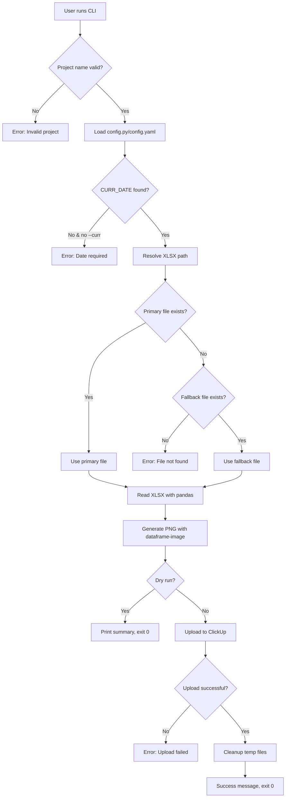

# Feature: XLSX Screenshot Upload to ClickUp

## Overview

Create a Python CLI tool that generates PNG screenshots from Excel state report files and uploads them to ClickUp with project metadata. The tool follows existing project conventions (Typer CLI, config.py/YAML parsing) and integrates with the ClickUp API v2.

## Problem Statement

After running scrapers, state count reports are generated as XLSX files in the `{PROJECT}/{DATE}/processed/` directory. Currently, there's no automated way to share these reports with stakeholders in ClickUp. Manual screenshot + upload is time-consuming and error-prone.

## Proposed Solution

A Typer-based CLI tool (`tools/xlsx_to_clickup.py`) that:
1. Reads project configuration to determine CURR_DATE
2. Locates the state counts XLSX file (with fallback pattern)
3. Generates a styled PNG screenshot using `dataframe-image`
4. Uploads the screenshot to a specified ClickUp task

## Technical Approach

### Architecture

```
tools/xlsx_to_clickup.py
├── CLI Interface (Typer)
│   ├── run command (main workflow)
│   ├── generate command (screenshot only)
│   └── upload command (upload only)
│
├── Config Loader
│   ├── Parse config.py (CURR_DATE, PROJECT_NAME)
│   └── Fallback to config.yaml if exists
│
├── File Resolver
│   ├── Primary: {project}-{date}-state_with_surrounding-counts.xlsx
│   └── Fallback: {project}-{date}-state_only-counts.xlsx
│
├── Screenshot Generator
│   ├── Read XLSX with pandas
│   ├── Style DataFrame
│   └── Export PNG with dataframe-image
│
└── ClickUp Client
    ├── Upload attachment to task
    └── Add comment with metadata
```

### Key Design Decisions

| Decision | Choice | Rationale |
|----------|--------|-----------|
| **CLI Framework** | Typer | Matches healthsparq/core patterns |
| **Screenshot Library** | dataframe-image | Cross-platform, pure Python, works with pandas |
| **Task ID Resolution** | CLI argument required | Simplest approach, avoids ClickUp workspace complexity |
| **Config Precedence** | config.py > config.yaml > CLI | CLI overrides all, config.py is primary |
| **API Token Storage** | Environment variable | Security best practice |
| **File Selection** | Primary preferred | state_with_surrounding if exists, else state_only |

### Dependencies

```
# New dependencies (add to requirements.txt or pyproject.toml)
dataframe-image>=0.2.3  # DataFrame to PNG conversion
requests>=2.31.0        # ClickUp API calls (already in project)
pandas>=2.0.0           # Excel reading (already in project)
openpyxl>=3.1.0         # XLSX engine (already in project)
typer>=0.9.0            # CLI framework (already in project)
```

## Implementation Phases

### Phase 1: Core Infrastructure

**Task 1.1: Create CLI skeleton with Typer**

File: `tools/xlsx_to_clickup.py`

```python
#!/usr/bin/env python3
"""Generate screenshots from XLSX state reports and upload to ClickUp."""

import typer
from pathlib import Path
from typing import Optional, Annotated
import os
import sys

app = typer.Typer(
    name="xlsx-to-clickup",
    help="Generate screenshots from XLSX reports and upload to ClickUp",
    no_args_is_help=True,
)

@app.command()
def run(
    project: Annotated[str, typer.Argument(help="Project name (e.g., audiobee_bcbs_il)")],
    task_id: Annotated[str, typer.Option("--task", "-t", help="ClickUp task ID")],
    curr_date: Annotated[Optional[str], typer.Option("--curr", "-c", help="Override CURR_DATE (YYYYMMDD)")] = None,
    dry_run: Annotated[bool, typer.Option("--dry-run", help="Validate without uploading")] = False,
    dpi: Annotated[int, typer.Option("--dpi", help="Screenshot resolution")] = 150,
):
    """Generate screenshot and upload to ClickUp in one step."""
    # Implementation in Phase 2
    pass

@app.command()
def generate(
    project: Annotated[str, typer.Argument(help="Project name")],
    output: Annotated[Path, typer.Option("--output", "-o", help="Output PNG path")] = None,
    curr_date: Annotated[Optional[str], typer.Option("--curr", "-c")] = None,
    dpi: Annotated[int, typer.Option("--dpi")] = 150,
):
    """Generate screenshot only (no upload)."""
    pass

@app.command()
def upload(
    image: Annotated[Path, typer.Argument(help="PNG file to upload")],
    task_id: Annotated[str, typer.Option("--task", "-t", help="ClickUp task ID")],
    comment: Annotated[Optional[str], typer.Option("--comment", "-m")] = None,
):
    """Upload existing image to ClickUp."""
    pass

if __name__ == "__main__":
    app()
```

**Task 1.2: Implement config loader**

```python
# tools/xlsx_to_clickup.py (add to file)
import importlib.util
import re

def load_project_config(project_name: str) -> dict:
    """
    Load CURR_DATE from project config.py or config.yaml.

    Priority: config.py > config.yaml
    Returns: {"curr_date": "YYYYMMDD", "project_name": "..."}
    """
    project_path = Path(project_name)

    # Validate project exists
    if not project_path.is_dir():
        raise FileNotFoundError(f"Project directory not found: {project_name}")

    # Sanitize project name (prevent path traversal)
    if ".." in project_name or project_name.startswith("/"):
        raise ValueError(f"Invalid project name: {project_name}")

    config = {"project_name": project_name, "curr_date": None}

    # Try config.py first
    config_py = project_path / "config.py"
    if config_py.exists():
        spec = importlib.util.spec_from_file_location("config", config_py)
        module = importlib.util.module_from_spec(spec)
        spec.loader.exec_module(module)

        if hasattr(module, "CURR_DATE"):
            config["curr_date"] = module.CURR_DATE
        if hasattr(module, "PROJECT_NAME"):
            config["project_name"] = module.PROJECT_NAME
        return config

    # Fallback to config.yaml (for healthsparq projects)
    config_yaml = project_path / "config.yaml"
    if config_yaml.exists():
        import yaml
        with open(config_yaml) as f:
            yaml_config = yaml.safe_load(f)

        if yaml_config and "project" in yaml_config:
            config["project_name"] = yaml_config["project"].get("slug", project_name)
        # Note: YAML configs don't store curr_date - must be provided via CLI
        return config

    raise FileNotFoundError(f"No config.py or config.yaml found in {project_name}")

def validate_date(date_str: str) -> str:
    """Validate and normalize date to YYYYMMDD format."""
    # Remove any separators
    normalized = date_str.replace("-", "").replace("/", "")

    if not re.match(r"^\d{8}$", normalized):
        raise ValueError(f"Invalid date format: {date_str}. Expected YYYYMMDD.")

    return normalized
```

**Task 1.3: Implement file resolver**

```python
# tools/xlsx_to_clickup.py (add to file)

def resolve_xlsx_path(project_name: str, curr_date: str) -> Path:
    """
    Find the state counts XLSX file.

    Primary: {project}/{date}/processed/{project}-{date}-state_with_surrounding-counts.xlsx
    Fallback: {project}/{date}/processed/{project}-{date}-state_only-counts.xlsx

    Raises FileNotFoundError if neither exists.
    """
    project_path = Path(project_name)
    processed_dir = project_path / curr_date / "processed"

    if not processed_dir.exists():
        raise FileNotFoundError(f"Processed directory not found: {processed_dir}")

    # Primary pattern
    primary_filename = f"{project_name}-{curr_date}-state_with_surrounding-counts.xlsx"
    primary_path = processed_dir / primary_filename

    if primary_path.exists():
        return primary_path

    # Fallback pattern
    fallback_filename = f"{project_name}-{curr_date}-state_only-counts.xlsx"
    fallback_path = processed_dir / fallback_filename

    if fallback_path.exists():
        return fallback_path

    # Neither found
    raise FileNotFoundError(
        f"No state counts file found in {processed_dir}. "
        f"Looked for:\n  - {primary_filename}\n  - {fallback_filename}"
    )
```

### Phase 2: Screenshot Generation

**Task 2.1: Implement screenshot generator**

```python
# tools/xlsx_to_clickup.py (add to file)
import pandas as pd
import dataframe_image as dfi
import tempfile

def generate_screenshot(
    xlsx_path: Path,
    output_path: Path = None,
    dpi: int = 150,
    sheet_name: str = None,
) -> Path:
    """
    Generate PNG screenshot from XLSX file.

    Args:
        xlsx_path: Path to XLSX file
        output_path: Output PNG path (auto-generated if None)
        dpi: Image resolution (default 150)
        sheet_name: Sheet to capture (default: first sheet)

    Returns:
        Path to generated PNG file
    """
    # Read Excel file
    df = pd.read_excel(
        xlsx_path,
        sheet_name=sheet_name or 0,
        engine="openpyxl",
    )

    # Handle empty DataFrame
    if df.empty:
        raise ValueError(f"Excel file is empty: {xlsx_path}")

    # Style the DataFrame for better appearance
    styled = df.style.set_properties(**{
        'text-align': 'center',
        'font-size': '10pt',
        'border': '1px solid #ddd',
        'padding': '4px',
    }).set_table_styles([
        {'selector': 'th', 'props': [
            ('background-color', '#4472C4'),
            ('color', 'white'),
            ('font-weight', 'bold'),
            ('text-align', 'center'),
            ('padding', '6px'),
        ]},
        {'selector': 'tr:nth-child(even)', 'props': [
            ('background-color', '#f9f9f9'),
        ]},
    ])

    # Generate output path if not provided
    if output_path is None:
        output_path = Path(tempfile.mktemp(suffix=".png"))

    # Export to PNG using matplotlib backend (no browser dependency)
    dfi.export(
        styled,
        str(output_path),
        dpi=dpi,
        table_conversion="matplotlib",
    )

    return output_path
```

**Task 2.2: Handle large tables**

```python
# Add configuration for large table handling
MAX_ROWS_DEFAULT = 100  # Rows before truncation warning

def generate_screenshot_with_limits(
    xlsx_path: Path,
    output_path: Path = None,
    dpi: int = 150,
    max_rows: int = MAX_ROWS_DEFAULT,
    truncate: bool = True,
) -> tuple[Path, dict]:
    """
    Generate screenshot with optional row limiting.

    Returns:
        (output_path, metadata) where metadata contains:
        - total_rows: Original row count
        - displayed_rows: Rows in screenshot
        - truncated: Whether data was truncated
    """
    df = pd.read_excel(xlsx_path, engine="openpyxl")

    metadata = {
        "total_rows": len(df),
        "displayed_rows": len(df),
        "truncated": False,
    }

    if len(df) > max_rows and truncate:
        df = df.head(max_rows)
        metadata["displayed_rows"] = max_rows
        metadata["truncated"] = True
        # Add footer row indicating truncation
        footer = pd.DataFrame({col: ["..."] for col in df.columns})
        footer.iloc[0, 0] = f"... {metadata['total_rows'] - max_rows} more rows"
        df = pd.concat([df, footer], ignore_index=True)

    # Apply styling and export
    styled = df.style.set_properties(**{'text-align': 'center'})

    if output_path is None:
        output_path = Path(tempfile.mktemp(suffix=".png"))

    dfi.export(styled, str(output_path), dpi=dpi, table_conversion="matplotlib")

    return output_path, metadata
```

### Phase 3: ClickUp Integration

**Task 3.1: Implement ClickUp client**

```python
# tools/xlsx_to_clickup.py (add to file)
import requests
import time

class ClickUpClient:
    """ClickUp API v2 client for attachment uploads."""

    BASE_URL = "https://api.clickup.com/api/v2"

    def __init__(self, api_token: str, max_retries: int = 3):
        self.api_token = api_token
        self.max_retries = max_retries

    def _request(
        self,
        method: str,
        endpoint: str,
        **kwargs,
    ) -> dict:
        """Make API request with retry logic."""
        url = f"{self.BASE_URL}{endpoint}"
        headers = kwargs.pop("headers", {})
        headers["Authorization"] = self.api_token

        for attempt in range(self.max_retries):
            response = requests.request(
                method,
                url,
                headers=headers,
                **kwargs,
            )

            if response.status_code == 429:
                # Rate limited - exponential backoff
                wait_time = 2 ** attempt
                time.sleep(wait_time)
                continue

            response.raise_for_status()
            return response.json()

        raise Exception(f"Max retries exceeded for {endpoint}")

    def upload_attachment(
        self,
        task_id: str,
        file_path: Path,
        filename: str = None,
    ) -> dict:
        """
        Upload a file as task attachment.

        IMPORTANT: Do NOT set Content-Type header manually.
        Let requests library handle multipart boundary.
        """
        endpoint = f"/task/{task_id}/attachment"

        # Use custom filename or original
        upload_name = filename or file_path.name

        with open(file_path, "rb") as f:
            # Key must be "attachment", NOT "attachment[]"
            files = {
                "attachment": (upload_name, f, "image/png")
            }
            return self._request("POST", endpoint, files=files)

    def add_comment(
        self,
        task_id: str,
        comment_text: str,
    ) -> dict:
        """Add a comment to a task."""
        endpoint = f"/task/{task_id}/comment"

        payload = {
            "comment_text": comment_text,
        }

        return self._request(
            "POST",
            endpoint,
            json=payload,
            headers={"Content-Type": "application/json"},
        )
```

**Task 3.2: Integrate upload with main workflow**

```python
# Update the run command implementation
@app.command()
def run(
    project: Annotated[str, typer.Argument(help="Project name (e.g., audiobee_bcbs_il)")],
    task_id: Annotated[str, typer.Option("--task", "-t", help="ClickUp task ID")] = None,
    curr_date: Annotated[Optional[str], typer.Option("--curr", "-c", help="Override CURR_DATE (YYYYMMDD)")] = None,
    dry_run: Annotated[bool, typer.Option("--dry-run", help="Validate without uploading")] = False,
    dpi: Annotated[int, typer.Option("--dpi", help="Screenshot resolution")] = 150,
    comment: Annotated[Optional[str], typer.Option("--comment", "-m", help="Comment to add")] = None,
):
    """Generate screenshot and upload to ClickUp in one step."""
    import tempfile

    # Load API token from environment
    api_token = os.environ.get("CLICKUP_API_TOKEN")
    if not api_token and not dry_run:
        typer.echo("Error: CLICKUP_API_TOKEN environment variable not set", err=True)
        typer.echo("\nTo set the token:", err=True)
        typer.echo("  export CLICKUP_API_TOKEN='pk_...'", err=True)
        raise typer.Exit(1)

    if not task_id and not dry_run:
        typer.echo("Error: --task/-t is required for upload", err=True)
        raise typer.Exit(1)

    try:
        # Load config
        typer.echo(f"Loading config for {project}...")
        config = load_project_config(project)

        # Determine date (CLI overrides config)
        date = curr_date or config.get("curr_date")
        if not date:
            typer.echo("Error: CURR_DATE not found in config and --curr not provided", err=True)
            raise typer.Exit(1)

        date = validate_date(date)
        typer.echo(f"Using date: {date}")

        # Resolve XLSX path
        xlsx_path = resolve_xlsx_path(project, date)
        typer.echo(f"Found: {xlsx_path}")

        if dry_run:
            typer.echo("\n[DRY RUN] Would generate screenshot and upload to ClickUp")
            typer.echo(f"  Source: {xlsx_path}")
            typer.echo(f"  Task: {task_id or '(not specified)'}")
            return

        # Generate screenshot
        typer.echo("Generating screenshot...")
        with tempfile.NamedTemporaryFile(suffix=".png", delete=False) as tmp:
            output_path = Path(tmp.name)

        try:
            generate_screenshot(xlsx_path, output_path, dpi=dpi)
            typer.echo(f"Screenshot saved: {output_path}")

            # Upload to ClickUp
            typer.echo(f"Uploading to ClickUp task {task_id}...")
            client = ClickUpClient(api_token)

            # Use descriptive filename
            upload_filename = f"{project}-{date}-state-counts.png"
            result = client.upload_attachment(task_id, output_path, upload_filename)

            typer.echo(typer.style("Upload successful!", fg=typer.colors.GREEN))

            # Add comment if provided
            if comment:
                full_comment = f"{comment}\n\nProject: {project}\nDate: {date}"
                client.add_comment(task_id, full_comment)
                typer.echo("Comment added")

        finally:
            # Cleanup temp file
            if output_path.exists():
                output_path.unlink()

    except FileNotFoundError as e:
        typer.echo(f"Error: {e}", err=True)
        raise typer.Exit(1)
    except Exception as e:
        typer.echo(f"Error: {e}", err=True)
        raise typer.Exit(2)
```

### Phase 4: Testing & Documentation

**Task 4.1: Add unit tests**

File: `tools/tests/test_xlsx_to_clickup.py`

```python
"""Tests for xlsx_to_clickup CLI tool."""

import pytest
from pathlib import Path
from unittest.mock import Mock, patch
import tempfile
import pandas as pd

# Import functions to test
import sys
sys.path.insert(0, str(Path(__file__).parent.parent))
from xlsx_to_clickup import (
    load_project_config,
    validate_date,
    resolve_xlsx_path,
    generate_screenshot,
    ClickUpClient,
)


class TestValidateDate:
    """Tests for date validation."""

    def test_valid_yyyymmdd(self):
        assert validate_date("20251227") == "20251227"

    def test_strips_dashes(self):
        assert validate_date("2025-12-27") == "20251227"

    def test_strips_slashes(self):
        assert validate_date("2025/12/27") == "20251227"

    def test_invalid_length(self):
        with pytest.raises(ValueError, match="Invalid date format"):
            validate_date("202512")

    def test_non_numeric(self):
        with pytest.raises(ValueError, match="Invalid date format"):
            validate_date("2025-ab-cd")


class TestLoadProjectConfig:
    """Tests for config loading."""

    def test_rejects_path_traversal(self, tmp_path):
        with pytest.raises(ValueError, match="Invalid project name"):
            load_project_config("../sensitive")

    def test_rejects_absolute_path(self, tmp_path):
        with pytest.raises(ValueError, match="Invalid project name"):
            load_project_config("/etc/passwd")

    def test_missing_project(self, tmp_path):
        with pytest.raises(FileNotFoundError):
            load_project_config("nonexistent_project")


class TestResolveXlsxPath:
    """Tests for XLSX file resolution."""

    def test_finds_primary_file(self, tmp_path):
        # Setup
        project = tmp_path / "test_project"
        processed = project / "20251227" / "processed"
        processed.mkdir(parents=True)

        primary = processed / "test_project-20251227-state_with_surrounding-counts.xlsx"
        primary.touch()

        # Test
        result = resolve_xlsx_path(str(project), "20251227")
        assert result == primary

    def test_falls_back_to_state_only(self, tmp_path):
        # Setup
        project = tmp_path / "test_project"
        processed = project / "20251227" / "processed"
        processed.mkdir(parents=True)

        fallback = processed / "test_project-20251227-state_only-counts.xlsx"
        fallback.touch()

        # Test
        result = resolve_xlsx_path(str(project), "20251227")
        assert result == fallback

    def test_prefers_primary_over_fallback(self, tmp_path):
        # Setup
        project = tmp_path / "test_project"
        processed = project / "20251227" / "processed"
        processed.mkdir(parents=True)

        primary = processed / "test_project-20251227-state_with_surrounding-counts.xlsx"
        fallback = processed / "test_project-20251227-state_only-counts.xlsx"
        primary.touch()
        fallback.touch()

        # Test - should prefer primary
        result = resolve_xlsx_path(str(project), "20251227")
        assert result == primary

    def test_raises_when_neither_exists(self, tmp_path):
        project = tmp_path / "test_project"
        processed = project / "20251227" / "processed"
        processed.mkdir(parents=True)

        with pytest.raises(FileNotFoundError, match="No state counts file found"):
            resolve_xlsx_path(str(project), "20251227")


class TestGenerateScreenshot:
    """Tests for screenshot generation."""

    def test_generates_png(self, tmp_path):
        # Create test XLSX
        xlsx_path = tmp_path / "test.xlsx"
        df = pd.DataFrame({"State": ["IL", "TX"], "Count": [100, 200]})
        df.to_excel(xlsx_path, index=False)

        # Generate screenshot
        output_path = tmp_path / "output.png"
        result = generate_screenshot(xlsx_path, output_path)

        assert result.exists()
        assert result.suffix == ".png"

    def test_raises_on_empty_file(self, tmp_path):
        xlsx_path = tmp_path / "empty.xlsx"
        df = pd.DataFrame()
        df.to_excel(xlsx_path, index=False)

        with pytest.raises(ValueError, match="empty"):
            generate_screenshot(xlsx_path)


class TestClickUpClient:
    """Tests for ClickUp API client."""

    @patch("requests.request")
    def test_upload_attachment(self, mock_request):
        mock_request.return_value.status_code = 200
        mock_request.return_value.json.return_value = {"id": "att123"}

        client = ClickUpClient("pk_test_token")

        # Create temp file
        with tempfile.NamedTemporaryFile(suffix=".png", delete=False) as f:
            f.write(b"fake png data")
            file_path = Path(f.name)

        try:
            result = client.upload_attachment("task123", file_path)
            assert result["id"] == "att123"

            # Verify request
            call_args = mock_request.call_args
            assert "Authorization" in call_args.kwargs["headers"]
            assert "files" in call_args.kwargs
        finally:
            file_path.unlink()

    @patch("requests.request")
    def test_retry_on_rate_limit(self, mock_request):
        # First call returns 429, second succeeds
        mock_response_429 = Mock()
        mock_response_429.status_code = 429

        mock_response_200 = Mock()
        mock_response_200.status_code = 200
        mock_response_200.json.return_value = {"comment_id": "c123"}

        mock_request.side_effect = [mock_response_429, mock_response_200]

        client = ClickUpClient("pk_test_token")
        result = client.add_comment("task123", "Test comment")

        assert result["comment_id"] == "c123"
        assert mock_request.call_count == 2
```

**Task 4.2: Update README/documentation**

Add to `tools/README.md`:

```markdown
## xlsx_to_clickup.py

Generate screenshots from XLSX state reports and upload to ClickUp.

### Installation

```bash
pip install dataframe-image  # Screenshot generation
```

### Setup

1. Get your ClickUp API token from Settings > Apps > API Token
2. Set environment variable:
   ```bash
   export CLICKUP_API_TOKEN='pk_12345678_ABCDEFGH'
   ```

### Usage

```bash
# Full workflow: generate + upload
python tools/xlsx_to_clickup.py run audiobee_bcbs_il --task CU12345

# Override date
python tools/xlsx_to_clickup.py run audiobee_bcbs_il --task CU12345 --curr 20251227

# Dry run (validate without uploading)
python tools/xlsx_to_clickup.py run audiobee_bcbs_il --dry-run

# Generate screenshot only
python tools/xlsx_to_clickup.py generate audiobee_bcbs_il --output report.png

# Upload existing image
python tools/xlsx_to_clickup.py upload report.png --task CU12345 --comment "Weekly report"
```

### Options

| Option | Short | Description |
|--------|-------|-------------|
| `--task` | `-t` | ClickUp task ID (required for upload) |
| `--curr` | `-c` | Override CURR_DATE (YYYYMMDD format) |
| `--dry-run` | | Validate paths without uploading |
| `--dpi` | | Screenshot resolution (default: 150) |
| `--comment` | `-m` | Comment to add with attachment |
| `--output` | `-o` | Output path for generate command |

### File Resolution

The tool looks for XLSX files in this order:
1. `{project}/{date}/processed/{project}-{date}-state_with_surrounding-counts.xlsx`
2. `{project}/{date}/processed/{project}-{date}-state_only-counts.xlsx`
```

## Acceptance Criteria

### Functional Requirements

- [ ] CLI accepts project name as positional argument
- [ ] CLI accepts `--task` option for ClickUp task ID
- [ ] CLI accepts `--curr` option to override CURR_DATE
- [ ] Reads CURR_DATE from project's config.py if not provided via CLI
- [ ] Falls back to config.yaml if config.py doesn't exist
- [ ] Finds primary XLSX file (state_with_surrounding pattern)
- [ ] Falls back to secondary XLSX file (state_only pattern)
- [ ] Generates PNG screenshot from XLSX data
- [ ] Uploads screenshot to specified ClickUp task
- [ ] Adds optional comment with project metadata
- [ ] Cleans up temporary files after upload

### Non-Functional Requirements

- [ ] Path traversal prevention (rejects `..` in project name)
- [ ] API token read from environment variable only
- [ ] Retry logic for ClickUp API rate limits (429)
- [ ] Meaningful error messages for all failure modes
- [ ] Dry-run mode for validation without side effects
- [ ] Exit code 0 on success, 1 on user error, 2 on system error

### Quality Gates

- [ ] Unit tests for all helper functions
- [ ] Integration test with mock ClickUp API
- [ ] Manual test with real ClickUp workspace
- [ ] Documentation updated in tools/README.md

## File Structure

```
tools/
├── xlsx_to_clickup.py       # Main CLI script
├── tests/
│   └── test_xlsx_to_clickup.py  # Unit tests
└── README.md                # Updated with usage docs
```

## ERD / Data Flow



## Security Considerations

1. **API Token**: Never hardcode - use `CLICKUP_API_TOKEN` environment variable
2. **Path Traversal**: Validate project name doesn't contain `..` or absolute paths
3. **Temp Files**: Always cleanup PNG files after upload (use `try/finally`)
4. **Input Validation**: Validate date format before using in file paths

## Dependencies

| Package | Version | Purpose |
|---------|---------|---------|
| typer | >=0.9.0 | CLI framework |
| dataframe-image | >=0.2.3 | DataFrame to PNG |
| pandas | >=2.0.0 | XLSX reading |
| openpyxl | >=3.1.0 | XLSX engine |
| requests | >=2.31.0 | ClickUp API |
| PyYAML | >=6.0.0 | YAML config parsing |

## References

### Internal References
- CLI patterns: `healthsparq/cli.py:11-313`
- Config loading: `healthsparq/config/loader.py`
- XLSX processing: `core/qa/debug_reports.py`
- Date validation: `healthsparq/cli.py:31-41`

### External References
- [ClickUp API - Create Task Attachment](https://developer.clickup.com/reference/createtaskattachment)
- [ClickUp API - Attachments Documentation](https://developer.clickup.com/docs/attachments)
- [dataframe-image PyPI](https://pypi.org/project/dataframe-image/)
- [Typer Documentation](https://typer.tiangolo.com/)
- [The Best Python Libraries for Excel in 2025](https://sheetflash.com/blog/the-best-python-libraries-for-excel-in-2024)
- [Converting Excel Sheets to High-Quality Images with Python](https://www.cloudthat.com/resources/blog/converting-excel-sheets-to-high-quality-images-with-python)

---

*Plan created: 2025-12-30*
*Target file: `tools/xlsx_to_clickup.py`*
