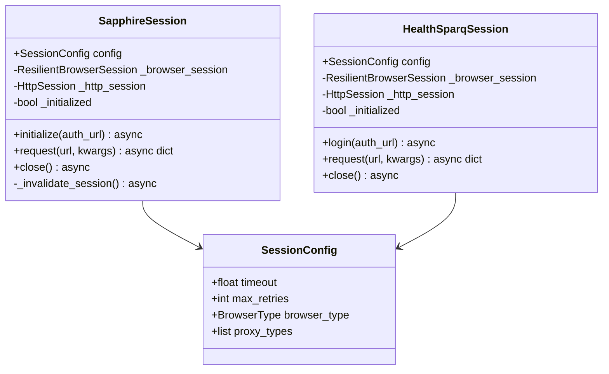

# Refactor: Align Sapphire Architecture with HealthSparq Patterns

**Type:** refactor
**Priority:** P2 (Medium)
**Created:** 2025-12-30
**Status:** Completed
**Completed:** 2025-12-30

## Overview

Standardize the `sapphire/` package architecture to follow `healthsparq/` patterns for consistency, maintainability, and code reuse across the scraper framework.

## Problem Statement

Both `healthsparq/` and `sapphire/` are scraper frameworks with similar 5-phase pipelines, but they evolved independently with inconsistent:

- Configuration schema naming and structure
- Phase execution patterns (Config/Result dataclasses)
- Session management patterns
- CLI argument conventions
- Public API exports
- Exception hierarchies
- Import patterns

This inconsistency makes it harder to maintain both packages, share code, and onboard developers.

## Proposed Solution

Align `sapphire/` to use `healthsparq/` as the canonical reference for all structural patterns while preserving Sapphire-specific domain logic (networks vs plans, geographic circles, etc.).

---

## Technical Approach

### Architecture Comparison Matrix

| Aspect             | HealthSparq (Canonical)      | Sapphire (Current)               | Alignment Required    |
| ------------------ | ---------------------------- | -------------------------------- | --------------------- |
| CLI Framework      | Typer                        | Typer                            | ✅ Aligned            |
| Phase Pattern      | `run_X()` + `run_X_sync()`   | `run_X()` + `run_X_sync()`       | ✅ Aligned            |
| Session Management | `HealthSparqSession` wrapper | Direct `ResilientBrowserSession` | Add wrapper class     |
| Storage Default    | `JSON_FILES`                 | `SQLITE`                         | Document difference   |
| Mapper Export      | `default_mapper` exported    | No mapper export                 | Add export            |
| Exception Base     | `HealthSparqError`           | `SapphireError`                  | Keep, align structure |

---

## Implementation Phases

### Phase 1: Phase Execution Pattern Alignment

**Goal:** Standardize Config/Result dataclass naming and structure.

#### 1.1 Align Config Dataclass Structure

Keep domain-specific names but align structure:

```python
# sapphire/phases/discovery.py - CURRENT
@dataclass
class DiscoveryConfig:
    config: SapphireProjectConfig
    curr_date: str
    output_dir: Optional[Path] = None
    storage_backend: Optional[StorageBackend] = None

# sapphire/phases/discovery.py - ALIGNED
@dataclass
class DiscoveryConfig:
    config: SapphireProjectConfig
    curr_date: str
    output_dir: Optional[Path] = None
    max_workers: Optional[int] = None  # ADD: consistency with HealthSparq
    storage_backend: Optional[StorageBackend] = None

    def __post_init__(self):  # ADD: HealthSparq pattern
        if self.output_dir is None:
            self.output_dir = Path(self.curr_date) / "raw" / "provider_ids"
```

**Files to modify:**

- `sapphire/phases/discovery.py:15-30`
- `sapphire/phases/details.py:15-30`
- `sapphire/phases/normalize.py:15-30`

#### 1.2 Standardize Result Dataclass Fields

```python
# CANONICAL PATTERN (HealthSparq SearchResult)
@dataclass
class SearchResult:
    location: str
    plan_code: str
    provider_count: int
    total_results: int
    output_file: Optional[str] = None
    error: Optional[str] = None
    filters_used: list[str] = field(default_factory=list)

# SAPPHIRE - ADD duration fields to match
@dataclass
class DiscoveryResult:
    state: str
    network_id: str
    provider_count: int
    unique_provider_ids: int
    output_file: Optional[str] = None
    error: Optional[str] = None
    # ADD: timing fields (HealthSparq pattern)
    duration_seconds: float = 0.0
    started_at: Optional[str] = None
    completed_at: Optional[str] = None
```

**Files to modify:**

- `sapphire/phases/discovery.py:35-50` - DiscoveryResult
- `sapphire/phases/details.py:35-50` - DetailsResult
- `sapphire/phases/normalize.py:35-50` - NormalizeResult

---

### Phase 2: Session Management Alignment

**Goal:** Create consistent session wrapper pattern.

#### 2.1 Add SapphireSession Wrapper Class

Create `sapphire/core/sapphire_session.py` following HealthSparq pattern:

```python
# sapphire/core/sapphire_session.py - NEW FILE
"""Sapphire session wrapper for browser-based API requests.

Follows HealthSparqSession pattern: browser login → HTTP session.
"""
from dataclasses import dataclass, field
from typing import Optional, Any
import asyncio

from core.session import ResilientBrowserSession, HttpSession, BrowserType
from core.proxy import ProxyType

@dataclass
class SessionConfig:
    """Configuration for Sapphire session."""
    timeout: float = 30.0
    max_retries: int = 5
    backoff_factor: float = 2.0
    max_backoff: float = 30.0
    user_agent: Optional[str] = None
    cookies: dict[str, str] = field(default_factory=dict)
    headers: dict[str, str] = field(default_factory=dict)
    proxy_types: list[ProxyType] = field(
        default_factory=lambda: [ProxyType.DATAIMPULSE_SESSION]
    )
    browser_type: BrowserType = BrowserType.CAMOUFOX

class SapphireSession:
    """Async HTTP session for Sapphire API requests.

    Pattern: Browser-based authentication → Fast HTTP for API calls.
    Follows HealthSparqSession architecture.
    """

    def __init__(self, config: SessionConfig):
        self.config = config
        self._browser_session: Optional[ResilientBrowserSession] = None
        self._http_session: Optional[HttpSession] = None
        self._lock = asyncio.Lock()
        self._initialized = False

    async def _invalidate_session(self) -> None:
        """Callback for auth errors - invalidate session for refresh."""
        self._initialized = False

    async def initialize(self, auth_url: str) -> None:
        """Initialize session with browser-based authentication."""
        async with self._lock:
            if self._initialized:
                return

            # Step 1: Browser login
            browser_kwargs = {"proxy_types": self.config.proxy_types}
            if self.config.browser_type is not None:
                browser_kwargs["browser_type"] = self.config.browser_type
            self._browser_session = ResilientBrowserSession(**browser_kwargs)
            await self._browser_session.login(auth_url)

            # Step 2: Extract cookies
            cookies = await self._browser_session.get_cookies()
            user_agent = await self._browser_session.get_user_agent()

            # Step 3: Create HTTP session
            self._http_session = HttpSession(
                on_auth_error=self._invalidate_session,
            )
            await self._http_session.initialize_from_browser(cookies, user_agent)
            self._initialized = True

    async def request(self, url: str, **kwargs) -> dict[str, Any]:
        """Make authenticated API request."""
        if not self._initialized:
            raise SessionError("Session not initialized")
        return await self._http_session.request(url, **kwargs)

    async def close(self) -> None:
        """Close all sessions."""
        if self._browser_session:
            await self._browser_session.close()
        if self._http_session:
            await self._http_session.close()
```

**Files to create:**

- `sapphire/core/sapphire_session.py` - New file

**Files to modify:**

- `sapphire/core/__init__.py` - Export SapphireSession
- `sapphire/core/session.py` - Use SapphireSession wrapper

---

### Phase 3: CLI Argument Alignment

**Goal:** Standardize CLI argument names and help text.

#### 3.1 CLI Argument Comparison

| Argument         | HealthSparq   | Sapphire            | Action         |
| ---------------- | ------------- | ------------------- | -------------- |
| `--curr`         | ✅            | ✅                  | Aligned        |
| `--prev`         | ✅            | ✅                  | Aligned        |
| `--phase`        | ✅ `-p` alias | ✅ No alias         | Add `-p` alias |
| `--dry-run`      | ✅ `-n` alias | ✅ No alias         | Add `-n` alias |
| `--storage`      | ✅ `-s` alias | ✅ No alias         | Add `-s` alias |
| `--qa`           | ✅            | ✅                  | Aligned        |
| `--validate`     | ✅            | ✅                  | Aligned        |
| `--compare`      | ✅            | ✅ (as `--compare`) | Aligned        |
| `--report`       | ✅            | ✅                  | Aligned        |
| `--excel`        | ✅            | ✅                  | Aligned        |
| `--samples-only` | ✅            | ✅                  | Aligned        |
| `--sample-count` | ✅            | ✅                  | Aligned        |

**Files to modify:**

- `sapphire/cli.py:45-80` - Add short aliases

```python
# sapphire/cli.py - ADD aliases
@app.command()
def run(
    project: str = typer.Argument(..., help="Project slug"),
    curr: str = typer.Option(..., "--curr", help="Current date (YYYYMMDD)"),
    prev: Optional[str] = typer.Option(None, "--prev", help="Previous date"),
    phase: Optional[int] = typer.Option(None, "--phase", "-p", help="Run specific phase"),  # ADD -p
    dry_run: bool = typer.Option(False, "--dry-run", "-n", help="Dry run mode"),  # ADD -n
    storage: Optional[str] = typer.Option(None, "--storage", "-s", help="Storage backend"),  # ADD -s
    # ... rest unchanged
):
```

---

### Phase 4: Public API Export Alignment

**Goal:** Standardize `__init__.py` exports.

#### 4.1 Sapphire Exports to Add

```python
# sapphire/__init__.py - CURRENT
from sapphire.config.loader import load_config
from sapphire.config.schema import SapphireProjectConfig
from sapphire.api import run_scraper_sync, run_scraper_async, ScraperResult

# sapphire/__init__.py - ALIGNED (add missing exports)
from sapphire.config.loader import load_config, list_projects
from sapphire.config.schema import (
    SapphireProjectConfig,
    StorageBackend,
    SessionConfig,  # ADD
)
from sapphire.api import (
    run_scraper_sync,
    run_scraper_async,
    run_scraper,  # ADD alias
    ScraperResult,
    PhaseResult,  # ADD
)
from sapphire.core import (
    SapphireAPI,  # ADD
    SapphireAPIConfig,  # ADD
    SapphireSession,  # ADD
)
from sapphire.phases.normalize import (
    MapperFunc,  # ADD
    default_sapphire_mapper,  # ADD (renamed from internal)
)

# Version
__version__ = "1.0.0"

__all__ = [
    # Configuration
    "load_config",
    "list_projects",
    "SapphireProjectConfig",
    "StorageBackend",
    "SessionConfig",
    # API
    "run_scraper",
    "run_scraper_sync",
    "run_scraper_async",
    "ScraperResult",
    "PhaseResult",
    # Core
    "SapphireAPI",
    "SapphireAPIConfig",
    "SapphireSession",
    # Normalization
    "MapperFunc",
    "default_sapphire_mapper",
    # Version
    "__version__",
]
```

**Files to modify:**

- `sapphire/__init__.py` - Add exports
- `sapphire/phases/normalize.py` - Rename/export `default_sapphire_mapper`

---

### Phase 5: Exception Hierarchy Alignment

**Goal:** Align exception constructor signatures.

#### 5.1 Exception Comparison

| Exception  | HealthSparq                                          | Sapphire                                            | Alignment                 |
| ---------- | ---------------------------------------------------- | --------------------------------------------------- | ------------------------- |
| Base       | `HealthSparqError(message, details)`                 | `SapphireError(message, details)`                   | ✅ Aligned                |
| API        | `APIError(message, url, status_code, response_text)` | `APIError(message, status_code, endpoint, details)` | Rename `endpoint` → `url` |
| Auth       | `AuthenticationError`                                | `AuthenticationError`                               | ✅ Aligned                |
| Config     | `ConfigurationError`                                 | `ConfigurationError`                                | ✅ Aligned                |
| Session    | `SessionError`                                       | `SessionError`                                      | ✅ Aligned                |
| Storage    | N/A                                                  | `StorageError`                                      | Keep (Sapphire-specific)  |
| Validation | N/A                                                  | `ValidationError`                                   | Keep (Sapphire-specific)  |

```python
# sapphire/core/exceptions.py - ALIGN APIError
class APIError(SapphireError):
    """Raised when API requests fail."""
    def __init__(
        self,
        message: str,
        url: str = "",  # Renamed from `endpoint`
        status_code: int = 0,
        response_text: str = "",  # Added (HealthSparq pattern)
        details: dict | None = None,
        # Keep backward compatibility
        endpoint: str = "",  # Deprecated alias
    ):
        super().__init__(message, details)
        self.url = url or endpoint  # Use endpoint as fallback
        self.status_code = status_code
        self.response_text = response_text
```

**Files to modify:**

- `sapphire/core/exceptions.py:25-40` - APIError class

---

### Phase 6: Import Pattern Alignment

**Goal:** Standardize import fallback patterns.

#### 6.1 Remove Legacy Fallback Imports

Sapphire correctly uses direct `core.` imports without fallbacks. HealthSparq should be cleaned up (separate task).

#### 6.2 Standardize Internal Imports

```python
# CANONICAL PATTERN - Use package-relative imports internally
from sapphire.config.schema import SapphireProjectConfig  # Full path
from .schema import SapphireProjectConfig  # Or relative within package

# AVOID - Mixed import styles
from config.schema import ...  # Ambiguous
from sapphire.config.schema import ...  # Inconsistent within package
```

**Files to review:**

- All `sapphire/**/*.py` files for import consistency

---

## Acceptance Criteria

### Functional Requirements

- [ ] Phase Config/Result dataclasses follow HealthSparq structure
- [ ] CLI arguments support same short aliases as HealthSparq
- [ ] Public API exports match HealthSparq pattern
- [ ] Exception constructors use consistent parameter names
- [ ] Session management follows HealthSparqSession pattern

### Non-Functional Requirements

- [ ] All existing tests pass after refactoring
- [ ] No breaking changes to CLI command syntax
- [ ] Documentation updated to reflect changes

### Quality Gates

- [ ] `python -m sapphire validate bcbs_il` passes
- [ ] `python -m sapphire run bcbs_il --curr 20251230 --dry-run` passes
- [ ] All tests in `sapphire/tests/` pass
- [ ] Type checking passes (`mypy sapphire/`)

---

## Dependencies & Prerequisites

- [ ] HealthSparq tests passing (reference implementation)
- [ ] Core package stable (`core/session.py`, `core/proxy/`)
- [ ] No active development on Sapphire configs

## Risk Analysis & Mitigation

| Risk                   | Likelihood | Impact | Mitigation                                 |
| ---------------------- | ---------- | ------ | ------------------------------------------ |
| Breaking library users | Medium     | High   | Keep old exports with deprecation warnings |
| Breaking CLI scripts   | Low        | Medium | Only add aliases, don't remove args        |
| Test failures          | Medium     | Low    | Run tests after each phase                 |

---

## File Change Summary

### New Files

- `sapphire/core/sapphire_session.py` - Session wrapper class

### Modified Files

- `sapphire/phases/discovery.py` - Align Config/Result dataclasses
- `sapphire/phases/details.py` - Align Config/Result dataclasses
- `sapphire/phases/normalize.py` - Align Config/Result, export mapper
- `sapphire/cli.py` - Add short aliases
- `sapphire/__init__.py` - Add exports
- `sapphire/core/__init__.py` - Export new classes
- `sapphire/core/exceptions.py` - Align APIError signature
- `sapphire/core/session.py` - Use SapphireSession wrapper

---

## References

### Internal References

- HealthSparq architecture: `healthsparq/CLAUDE.md`
- Sapphire architecture: (none, to be documented)
- Core session: `core/session/browser_session.py:1-150`
- Core proxy: `core/proxy/providers/`

### External References

- Typer documentation: https://typer.tiangolo.com/
- Pydantic v2 field aliases: https://docs.pydantic.dev/latest/concepts/fields/#field-aliases

---

## Class Diagram: Session Management Pattern



---

## Next Steps After Approval

1. Create feature branch: `feat/sapphire-healthsparq-alignment`
2. Implement Phase 1 (Phase Execution Pattern) first with tests
3. Submit PR for review after each phase
4. Update CLAUDE.md documentation after completion
